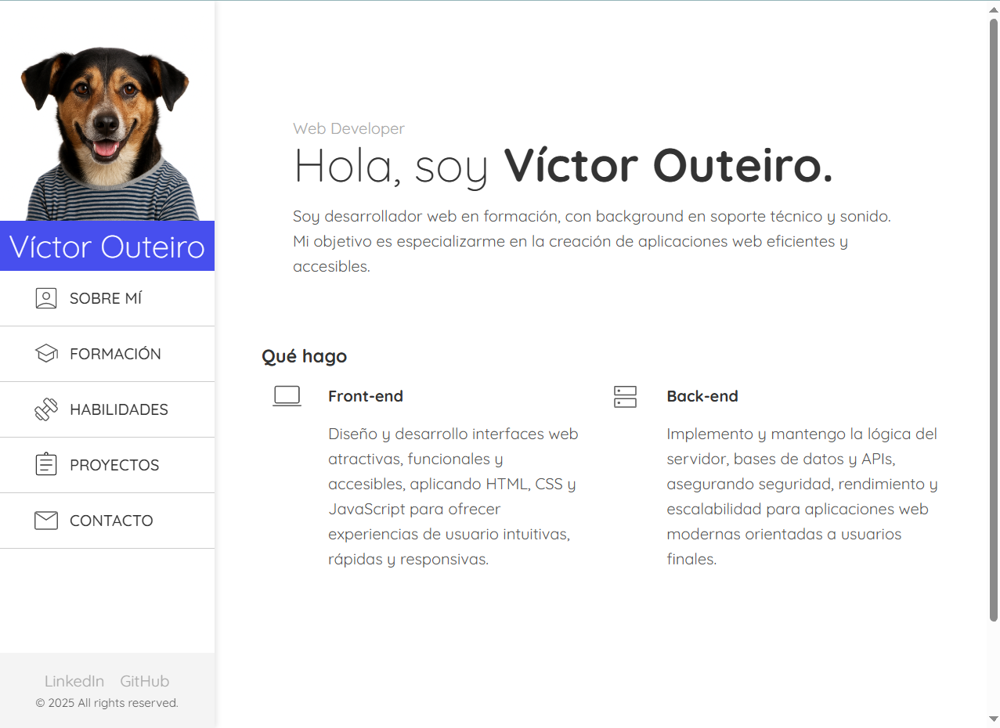
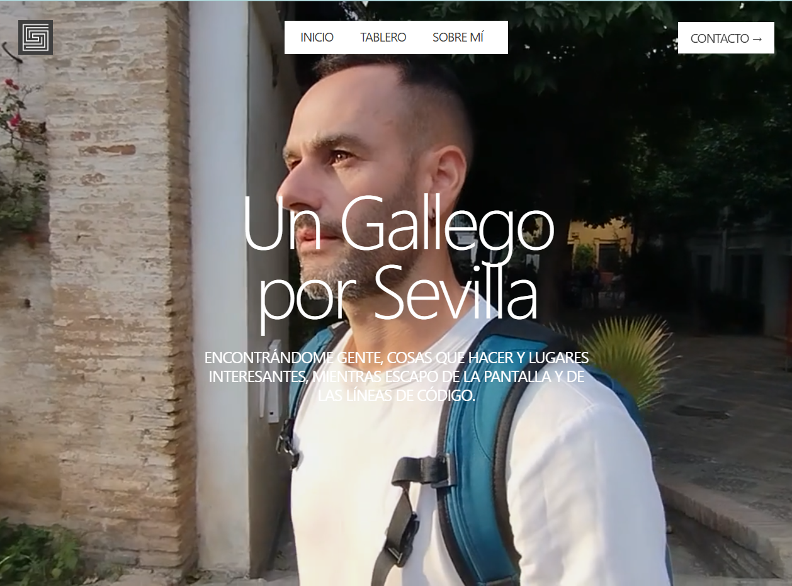
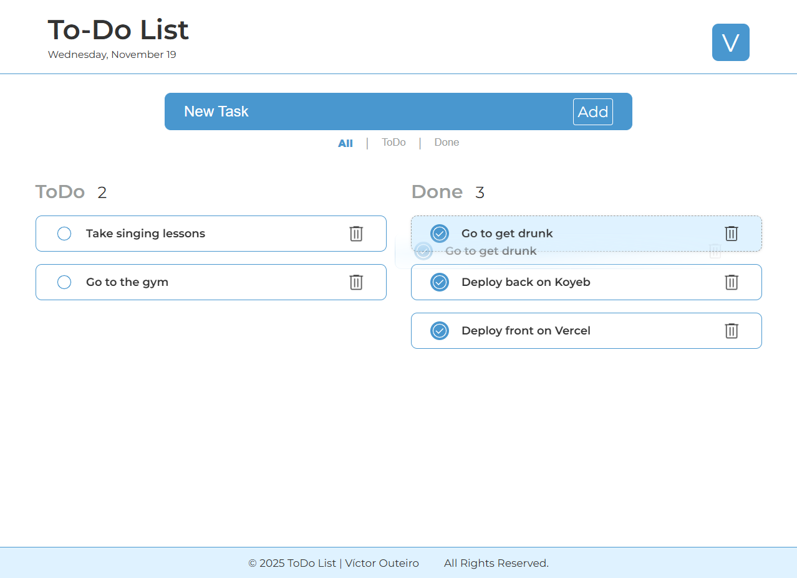
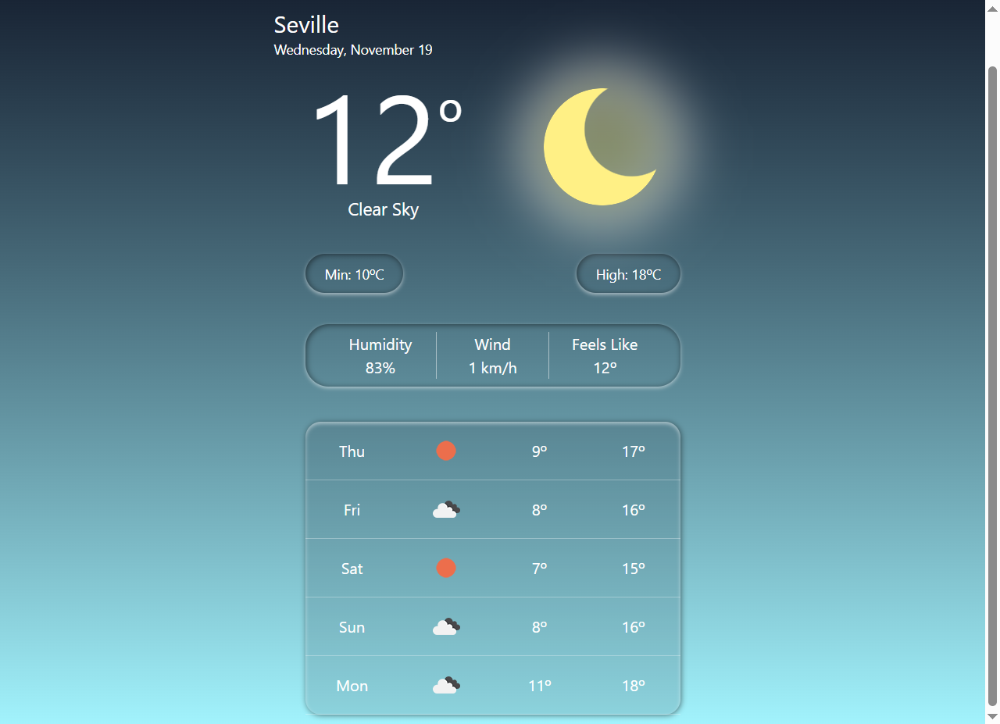

  

   

  
  
  

   
   

---

### ⚡ Sobre mí / About Me

<table>
<tr>
<td width="50%">

### 🇪🇸 Hola, soy Víctor (Radu-A)
Soy **Desarrollador Web Junior** con sólidos conocimientos en React, Tailwind, Node.js, Express, MongoDB y PostgreSQL. Vengo de entornos donde la comunicación, el trabajo en equipo y la resolución de incidencias eran parte del día a día, lo que me permite integrarme con facilidad en equipos de desarrollo.

Me defino por:
* 👨‍💻 **Ganas de aprender**  
* 🧩 **Capacidad para resolver problemas y colaborar**  
* ⚡ **Ritmo, compromiso y constancia**

</td>
<td width="50%">

### 🇬🇧 Hi, I'm Víctor (Radu-A)
I am a Junior Web Developer with a strong foundation in React, Tailwind, Node.js, Express, MongoDB, and PostgreSQL. My background comes from environments where communication, teamwork, and troubleshooting were daily essentials—experience that allows me to seamlessly integrate into development teams.

I define myself by:
* 👨‍💻 **Eagerness to learn**  
* 🧩 **Problem-solving and collaboration**  
* ⚡ **Pace, commitment, and consistency** 

</td>
</tr>
</table>

  
<i>"Looking for a developer who is consistent, direct, and eager to grow? Here I am."</i>

---

### 🛠️ Tech Stack

 

 

---

### 🚀 Featured Projects

| Project | Description & Tech |
| :---: | :---: |
|  | **CV Web** My personal digital resume and portfolio.  `HTML` `CSS` `JS` 🔗 [Live Demo](https://victor-outeiro.vercel.app) • 💻 [Code](https://github.com/Radu-A/cv-web) |
|  | **Galician Man in Seville** A blog/guide platform for expats.  `React` `Tailwind` `Firebase` 🔗 [Live Demo](https://galician-man-in-seville.vercel.app) • 💻 [Code](https://github.com/Radu-A/galician-man-in-seville) |
|  | **Full Stack ToDo** Task management with database persistence.  `Node` `Mongo` `Express` 🔗 [Live Demo](https://todo-front-mu.vercel.app) • 💻 [Code](https://github.com/Radu-A/todo-front) |
|  | **Weather App** Real-time weather tracking using API.  `React` `API Rest` `Tailwind` 🔗 [Live Demo](https://weather-app-delta-pink-13.vercel.app) • 💻 [Code](https://github.com/Radu-A/weather-app) |

---

### 📊 GitHub Activity

  

  
  

 

---

  
🌍 <b>Galician in Seville</b> • 📸 <b>Photography Enthusiast</b> • ☕ <b>Coffee & Code</b>

  
Feel free to reach out!

